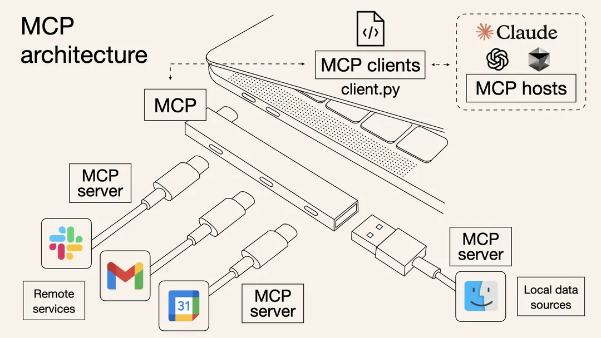

# MCP

## 背景

最近比较火的一个技术——[MCP](https://github.com/modelcontextprotocol/servers)（Model Context Protocol，模型上下文协议）是一种由Anthropic公司推出的一个开放标准协议，目的就是为了解决 AI 模型与外部数据源、工具交互的难题。传统Function Call存在先天性的不足：线性指令执行机制带来的性能瓶颈与异构接口标准带来的兼容性瓶颈。而MCP的设计思路则不同，它遵循微内核架构的设计理念：定义架构和协议标准。号称工具调用的USB-C标准。

本篇文章注重实践，如果缺乏基础知识则移步至其他文章进行学习。

## MCP基本架构

### HOST

### MCP Server

### MCP Client

## 实践

### Cline

### 出行助手

### 智能问数