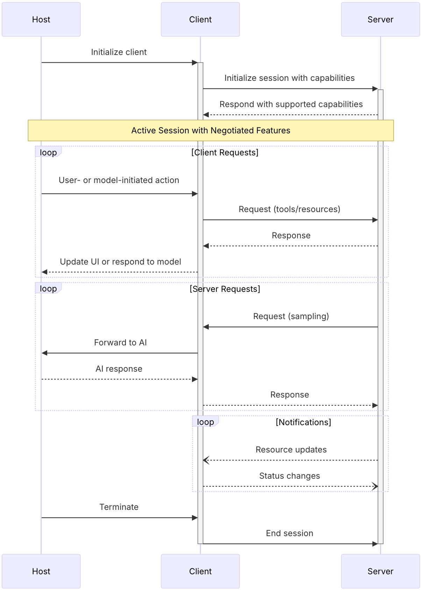

# MCP

之前对LLM相关知识了解的不多，最近看了一些MCP相关的文章，通过工具获取外部系统数据或实时数据读取(在此之前没了解Function Call)，觉得很牛*。看了一些文章，发现MCP扩展LLM的能力，动手实践了一下。围绕着LLM还是需要提示词工程

## 背景

最近比较火的一个技术——[MCP](https://github.com/modelcontextprotocol/servers)（Model Context Protocol，模型上下文协议）是一种由Anthropic公司推出的一个开放标准协议，目的就是为了解决 AI 模型与外部数据源、工具交互的难题。传统Function Call存在先天性的不足：线性指令执行机制带来的性能瓶颈与异构接口标准带来的兼容性瓶颈。而MCP的设计思路则不同，它遵循微内核架构的设计理念：定义架构和协议标准。号称工具调用的USB-C标准。


本篇文章注重实践，如果缺乏基础知识则移步至其他文章进行学习。


## MCP基本架构



### HOST

1. 创建和管理多个客户端实例
2. 控制客户端连接权限和生命周期
3. 强制执行安全策略和同意要求
4. 处理用户授权决策
5. 协调 AI/LLM 集成和采样
6. 管理跨客户端的上下文聚合

### MCP Clients
1. 建立每个服务器的一个有状态会话
2. 处理协议协商和能力交换
3. 路由协议消息双向传输
4. 管理订阅和通知
5. 维护服务器之间的安全边界

主机应用程序创建和管理多个客户端，每个客户端与特定服务器之间保持一对一的关系。

### MCP Servers

1. 通过 MCP 原语公开资源、工具和提示
2. 独立运行，承担专注的责任
3. 通过客户端接口请求采样
4. 必须遵守安全约束
5. 可以为本地进程或远程服务


## 实践

从两个方面去实践MCP：
1. 可以使用`Cusor`和`Claude`去连接一些mcp server，直接使用。这些需要付费使用，`VS code + Cline` 免费使用，完成一个出行助手
2. 通过官方提供的sdk，去编码实现一个MCP Server和MCP Client


### Cline

在`VS code`中下载`Cline`插件，并选择配置自己的LLM和密钥


获取MCP Server 的途径

- 官方的GitHub:https://github.com/modelcontextprotocol/servers
- 第三方的 MCP Server 聚合平台，目前收录了 5000+ MCP Server:https://mcp.so/

#### 出行助手

##### 集成高德MCP Server，可以调用地图相关Tools

需要申请高德开发者`API_KEY`，个人使用很容易申请，地址:https://console.amap.com/dev/key/app
   

MacOS选手配置如下

```json
{
   "mcpServers": {
      "amap-maps": {
         "command": "npx",
         "args": [
           "-y",
           "@amap/amap-maps-mcp-server"
         ],
         "env": {
           "AMAP_MAPS_API_KEY": ""
         }
      }
   }
}
```

**注意注意:** windows选手的配置不一样，很容易踩坑，配置如下

```json
{
   "mcpServers": {
      "amap-maps": {
         "command": "cmd",
         "args": [
            "/c",
            "npx",
            "-y",
            "@amap/amap-maps-mcp-server"
         ],
         "env": {
           "AMAP_MAPS_API_KEY": ""
         }
      }
   }
}
```
配置好之后，可以查看这个server有哪些tools


##### 设置提示词


现在可以正常进行提问

```
五一计划去武汉游玩4天的旅行攻略：

1. 帮制作旅行攻略，考虑出行时间和路线，以及天气状况路线规划。

1.1 制作网页地图自定义绘制旅游路线和位置。

1.2 网页使用简约美观页面风格，景区图片以卡片展示。

2. 行程规划结果在高德地图app展示，并集成到h5页面中。

2.2 同一天行程景区之间我想打车前往。

3. 生成文件名 travel.html。
```


到这里为止，使用LLM结合MCP的应用已完毕

#### 计算器 MCP

这里使用官方提供的sdk，编码完成一个 mcp server

##### 应用环境

JDK 17+
springboot 3.3及以上

##### 编码

核心依赖
```xml
<dependency>
    <groupId>org.springframework.ai</groupId>
    <artifactId>spring-ai-mcp</artifactId>
</dependency>
```
编写一个计算器 tools

```java
public class ToolService {
    @Tool(name = "calculator", description = "简单的计算器工具")
    public String calculator(
            @ToolParam(description = "第一个数字 a") Double a,
            @ToolParam(description = "第二个数字 b") Double b,
            @ToolParam(description = "计算操作符(+ - * /)") String operation
    ) {
        double result = switch (operation) {
            case "+" -> a + b;
            case "-" -> a - b;
            case "*" -> a * b;
            case "/" -> a / b;
            default -> throw new IllegalArgumentException("未知操作");
        };
        return String.format("""
                这里是计算器工具
                %s %s %s = %s
                """, a, operation, b, result);
    }
}
```

启动程序时注册工具
```java
@Bean
public ToolCallbackProvider weatherTools(ToolService toolService) {
    return MethodToolCallbackProvider.builder().toolObjects(toolService).build();
}
```

应用打包
```shell
mvn clean package -DskipTests
```

##### Cline 测试

配置mcp
```json
{
  "mcpServers": {
    "demo": {
      "disabled": false,
      "timeout": 60,
      "command": "java",
      "args": [
        "-Dspring.ai.mcp.server.stdio=true",
        "-Dspring.main.banner-mode=off",
        "-Dspring.main.web-application-type=none",
        "-Dserver.port=8001",
        "-Dlogging.pattern.console=",
        "-jar",
        "/Users/wx/workspace/tvi/zz/spring-mcp/spring-mcp-server/target/spring-mcp-server.jar"
      ],
      "transportType": "stdio"
    }
  }
}
```

注意：这些命令相当启动jar，需要注意端口冲突，还需要禁止控制台输出

### 编码 MCP Client

#### 应用环境

JDK 17+
springboot 3.3及以上

#### 编码

核心依赖
```xml
<dependencies>
    <dependency>
        <groupId>org.springframework.boot</groupId>
        <artifactId>spring-boot-starter-web</artifactId>
    </dependency>
    <dependency>
        <groupId>org.springframework.ai</groupId>
        <artifactId>spring-ai-starter-model-openai</artifactId>
    </dependency>
    <dependency>
        <groupId>org.springframework.ai</groupId>
        <artifactId>spring-ai-starter-mcp-client</artifactId>
    </dependency>
</dependencies>
```

配置文件，`application.yaml`
```yaml
spring:
  ai:
    openai:
      api-key: sk-***
      base-url: https://api.deepseek.com
      chat:
        options:
          model: deepseek-chat
    mcp:
      client:
        enabled: true
        name: demo
        version: 1.0.0
        type: sync
        request-timeout: 20s
        stdio:
          servers-configuration: classpath:/mcp-server-config.json


logging:
  level:
    io:
      modelcontextprotocol:
        client: debug
        spec: debug
```

`mcp-server-config.json` 配置文件
```json
{
  "mcpServers": {
    "amap-maps": {
      "command": "npx",
      "args": [
        "-y",
        "@amap/amap-maps-mcp-server"
      ],
      "env": {
        "AMAP_MAPS_API_KEY": "********"
      }
    },
    "demo": {
      "command": "java",
      "args": [
        "-Dspring.ai.mcp.server.stdio=true",
        "-Dserver.port=7002",
        "-Dspring.main.banner-mode=off",
        "-Dspring.main.web-application-type=none",
        "-Dlogging.pattern.console=",
        "-Dtransport.mode=stdio",
        "-jar",
        "/Users/wx/workspace/tvi/zz/spring-mcp/spring-mcp-server/target/spring-mcp-server.jar"
      ],
      "env": {
      }
    }
  }
}
```

启动类 `Main.java`
```java
@SpringBootApplication
public class Main {
    public static void main(String[] args) {
        SpringApplication.run(Main.class, args);
    }

    @Bean
    public CommandLineRunner predefinedQuestions(ChatClient.Builder chatClientBuilder, List<McpSyncClient> mcpSyncClients) {
        return args -> {
            var chatClient = chatClientBuilder
                    .defaultSystem("""
                            你是个人小助手.
                            如果用户问出行相关请使用amap-maps相关工具回答;
                            如果用户问计算问题请使用demo mcp相关工具回答；
                            如果用户问题与上述无关，提醒用户“问题不在处理范围内”，并告诉用户你有哪些能力
                            """)
                    .defaultTools(new SyncMcpToolCallbackProvider(mcpSyncClients))
                    // .defaultAdvisors(new MessageChatMemoryAdvisor(new InMemoryChatMemory()))
                    .build();
            for (McpSyncClient client : mcpSyncClients) {
                System.out.println("mcp server => " + client.getServerInfo().name());
            }
            System.out.println("\n我是个人小助手\n");
            try (Scanner scanner = new Scanner(System.in)) {
                while (true) {
                    System.out.print("\n用户: ");
                    System.out.println("\nASSISTANT: " +
                            chatClient.prompt(scanner.nextLine())
                                    .call()
                                    .content());
                }
            }
        };
    }
}
```


至此，使用LLM增强应用的方法实践已结束，虽然我们的编码的案例比较简单，但是这里面的想象空间还是很大很大，打破了LLM的无法获取外界数据的局限性。之前有Function Call可以实现这种功能，但是是各个大模型厂商制定的，兼容性不高。MCP统一了使用规范，号称工具调用的USB-C标准。

